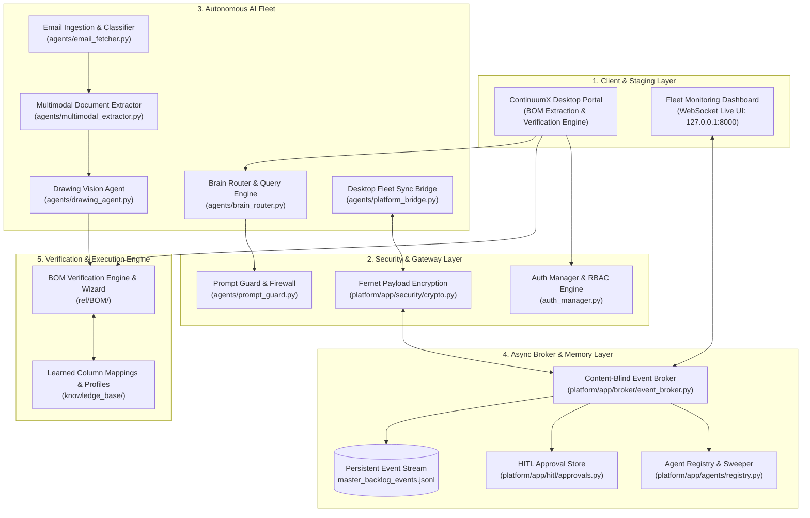

# ContinuumX Agentic Platform — MAIC Showcase & Blueprint

ContinuumX is a multi-tenant, hybrid AI orchestration platform engineered for High-Mix Low-Volume (HMLV) smart manufacturing, precision cable assembly, and semiconductor fabrication. It forms an autonomous intelligence overlay on top of existing Manufacturing Execution Systems (MES) and Enterprise Resource Planning (ERP) infrastructure.

This repository contains the core agentic runtime, multimodal CAD drawing parsing engine, content-blind event broker, encrypted messaging SDK (`AgentComms`), real-time WebSocket fleet monitoring dashboard, and the desktop **BOM Verification & Extraction Engine**.

---

## 1. Key System Features

*   **Autonomous Blueprint-to-BOM Extraction**: Employs vision-language models (VLMs) and an Evidence Graph lineage schema to extract Title Blocks, connector tables, wire gauges, and terminal codes directly from PDF drawings.
*   **Hybrid AI Data Routing**: Routes public/commercial queries to cloud models (Gemini Flash) while keeping sensitive engineering CAD blueprints isolated on local edge nodes.
*   **Encrypted Inter-Agent Communication**: Client-side Fernet envelope encryption protects message contents while exposing cleartext routing headers for broker telemetry and audit tracking.
*   **Human-in-the-Loop (HITL) Validation Gates**: Autonomous execution pauses safely at critical thresholds (e.g. MOQ assignment, gross margin sign-offs) for operator review.
*   **Live Fleet Observability**: WebSocket-driven monitoring dashboard displaying live agent status cards, CPU/RAM telemetry gauges, and an append-only event stream.

---

## 2. Platform Architecture Overview



---

## 3. Starting the Platform Server & Live Dashboard

The platform backend is powered by FastAPI and provides an asynchronous event broker, health sweeper, and WebSocket dashboard.

### 3.1 Environment Setup
```bash
# 1. Create and activate virtual environment
python -m venv .venv

# On Windows (PowerShell):
.venv\Scripts\Activate.ps1
# On Linux / macOS:
source .venv/bin/activate

# 2. Install dependencies
pip install -r platform/requirements.txt
pip install matplotlib openpyxl pandas pydantic fastapi uvicorn cryptography
```

### 3.2 Launch the FastAPI Platform Server
From your first terminal:
```bash
cd platform
uvicorn app.main:app --host 127.0.0.1 --port 8000 --reload
```
*   **Live Web Dashboard**: Open **`http://127.0.0.1:8000/`** in your browser.
*   Displays real-time fleet health cards, CPU/RAM telemetry meters, encrypted message streams, and the Human-in-the-Loop approval queue.

### 3.3 Connect the Desktop Fleet (Platform Sync Bridge)
In a second terminal:
```bash
python -m agents.platform_bridge
```
*   Registers all fleet agents (`Brain`, `BOM`, `Sourcing`, `Cycle Time`, `Costing`, `NPI`, `WI`) with the central server.
*   Watch `http://127.0.0.1:8000/` update in real-time as agent status badges flip to **`Online`** with active telemetry.

---

## 4. End-to-End Mock Testing Guide

Follow these testing scenarios to demonstrate the entire agentic pipeline:

### Scenario A: Encrypted Agent-to-Agent Messaging Demo
Demonstrates client-side encryption (`platform/app/security/crypto.py`) where message bodies are encrypted with Fernet and only envelope headers are routed by the broker:

1. **Terminal A** (Start Responder Agent B):
   ```bash
   python -m platform.agents.demo_agent --id agent_b --peer agent_a
   ```
2. **Terminal B** (Start Initiator Agent A):
   ```bash
   python -m platform.agents.demo_agent --id agent_a --peer agent_b --initiate
   ```
3. **Verification**:
   - Both agents execute the encrypted handshake: `hello` ➡️ `hello_ack` ➡️ `byebye`.
   - The Web Dashboard at `http://127.0.0.1:8000/` records each transaction in the live event stream.

---

### Scenario B: Natural Language AI Brain & Chart Analytics
Demonstrates natural language database querying and dynamic Matplotlib chart generation via the Central Brain Router:

```bash
python -c "
import sys
sys.stdout.reconfigure(encoding='utf-8')
from agents.brain_router import BrainRouter, detect_chart_intent, generate_rfq_chart

r = BrainRouter()

# 1. Natural Language System Status Query
print('=== 1. System Overview ===')
print(r.answer_system_query('What is the system status?'))

# 2. Stage Filtering Query
print('\n=== 2. BOM Stage RFQs ===')
print(r.answer_system_query('Which RFQs are in BOM Verification?'))

# 3. Chart Generation Engine
print('\n=== 3. Chart Generation ===')
intent = detect_chart_intent('show me the stage distribution pie chart')
fig = generate_rfq_chart(intent)
print('Generated Figure:', type(fig))
"
```

---

### Scenario C: Desktop Portal & BOM Verification Engine
Demonstrates the desktop enterprise portal with Role-Based Access Control (RBAC) and the AI BOM extraction wizard:

```bash
python main.py
# Or launch directly via:
python launcher.py
```

#### Demo Login Credentials:
| Username | Password | Role | Access Level |
| :--- | :--- | :--- | :--- |
| **`admin`** | **`admin123`** | **System Administrator** | **Full Access** (BOM Verification Engine + Admin Portal) |
| **`sysadmin`** | **`password123`** | **System Administrator** | **Full Access** (BOM Verification Engine + Admin Portal) |
| **`engineer`** | **`password123`** | **Engineering** | **BOM Verification & Extraction Engine** |
| **`sourcing`** | **`password123`** | **Sourcing** | **BOM Verification & Extraction Engine** |
| **`costing`** | **`password123`** | **Costing** | **BOM Verification & Extraction Engine** |

---

### Scenario D: Automated Test Suites
Run the automated test suites to validate all components:

```bash
# 1. Run Platform Core Unit Tests
python -c \"import sys; sys.path.insert(0, 'platform'); from platform.tests.test_crypto import test_roundtrip; print('Platform crypto verified!')\"

# 2. Run End-to-End Email Ingestion, Multimodal Extraction, & Drawing Parser Pipeline
python test_email_rfq_pipeline.py
```

---

## 5. Architectural Documents

*   **[Technical Architecture Document](TECHNICAL_ARCHITECTURE_DOCUMENT.md)**: Full production architecture, agent specifications, security model, and implementation gap audit.
*   **[Hackathon Technical Blueprint (PDF)](HACKATHON_TECHNICAL_ARCHITECTURE.pdf)**: Pitch-ready executive architecture document.
*   **[Agent Tool Registry Audit](docs/AGENT_TOOL_REGISTRY_AUDIT.md)**: 5-tier safe execution tool catalog and permission matrix.
*   **[Orchestrator Design](docs/ORCHESTRATOR_DESIGN.md)**: State machine, dependency graph, and approval gate flow.

---

## 6. License & Copyright Notice

This repository and its contents are proprietary and subject to a **Restricted Evaluation License** — see the [LICENSE](LICENSE) file for complete terms.

> **IMPORTANT**: This codebase and its architectural artifacts are made publicly accessible **solely and exclusively for the MAIC Nexus Challenge artifact review and judging process**. Cloning, reproducing, modifying, redistributing, or deploying this repository for personal, commercial, or organizational use is strictly prohibited.

```text
Copyright (c) 2025-2026 ContinuumX Platform. All Rights Reserved.
```

