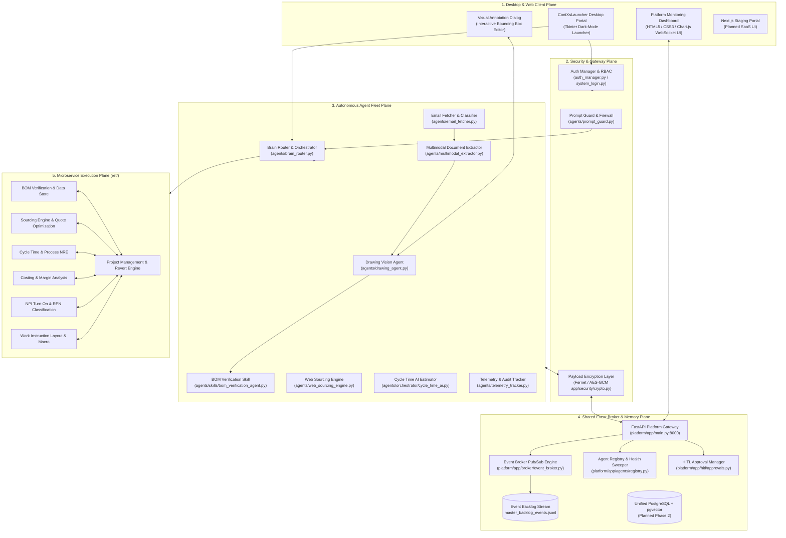

# ContinuumX Agentic Platform — Technical Architecture Document (TAD)

**Document Version**: 2.0.0 (Production Architecture & Implementation Audit)  
**System**: ContinuumX Agentic Platform (`ContXsLauncher` Ecosystem)  
**Classification**: Public Template Ready (Sanitized)  
**Target Environments**: Multi-Tenant Cloud / Hybrid Edge Slicing / Air-Gapped On-Premises Workstations  

---

## 1. Executive Summary & Core Philosophy

The **ContinuumX Agentic Platform** is a multi-tenant, hybrid AI orchestration system designed for High-Mix Low-Volume (HMLV) smart manufacturing, precision cable assembly, and semiconductor fabrication. It forms an autonomous intelligence overlay on top of existing Manufacturing Execution Systems (MES) and Enterprise Resource Planning (ERP) infrastructure.

```
                                  [ INCOMING RFQ / ENGINEERING DRAWINGS ]
                                                     │
                                                     ▼
                              ┌─────────────────────────────────────────────┐
                              │        CENTRAL HYBRID BRAIN ROUTER          │
                              │            (agents/brain_router.py)         │
                              └──────┬───────────────────────────────┬──────┘
                                     │                               │
                      [ Public / Commercial Data ]      [ Sensitive Intellectual Property ]
                                     │                               │
                                     ▼                               ▼
                      ┌─────────────────────────────┐ ┌─────────────────────────────┐
                      │   Cloud-Hosted Gemini LLM   │ │  Local Edge VLM / Ollama    │
                      │   (Sourcing, Markup, NLP)   │ │  (Blueprints, Pinouts, CAD) │
                      └──────────────┬──────────────┘ └──────────────┬──────────────┘
                                     │                               │
                                     └───────────────┬───────────────┘
                                                     │
                                                     ▼
                                      ┌─────────────────────────────┐
                                      │   5-TIER AGENT TOOL REGISTRY│
                                      │   (agents/tool_registry.py) │
                                      └──────────────┬──────────────┘
                                                     │
         ┌───────────────────┬───────────────────────┼───────────────────────┬───────────────────┐
         ▼                   ▼                       ▼                       ▼                   ▼
   ┌───────────┐       ┌───────────┐           ┌───────────┐           ┌───────────┐       ┌───────────┐
   │ BOM Engine│       │ Sourcing  │           │Cycle Time │           │  Costing  │       │ NPI & WI  │
   │ (ref/BOM) │       │(ref/Sourc)│           │(ref/Cycle)│           │(ref/Cost) │       │(ref/NPI/W)│
   └───────────┘       └───────────┘           └───────────┘           └───────────┘       └───────────┘
```

### Core Architectural Principles
1. **Existing Systems are the Single Source of Truth**: The Agent does **NOT** recreate or bypass business logic. Calculation models (Sourcing optimization, Cycle Time process tables, Costing margins, IPC-A-620 work instructions) and lifecycle stage transitions remain governed by their dedicated microservices and deterministic validation rules.
2. **Autonomous Execution with Human-in-the-Loop (HITL) UI Gates**: The platform executes background RPA tasks autonomously where safe, but halts at strict approval gates (e.g. MOQ assignment, gross margin sign-off) to launch native review windows and capture human adjustments.
3. **Evidence-First Multimodal Extraction**: Drawing parsing utilizes an Evidence Graph schema where all extracted component values (wire gauges, strip lengths, connector part numbers, terminal codes) are linked directly to bounding-box coordinates, OCR text anchors, and confidence scores.
4. **Point-of-Failure Isolation Contract**: Subsystems pass variables using a strict UUID boundary contract (`transaction_uuid`). Data correctness within database context belongs to Team 2 (Business Logic), while network transport, authentication, and audit logging belong to Team 3 (Infrastructure).

---

## 2. Entire System Architecture: Current vs. Planned

The system is partitioned into five distinct architectural planes:



---

## 3. Implementation Status Audit: Done vs. Planned

A thorough comparison of the actual implemented codebase against the master documentation in `AgenticPlatform/` (`platform_overview.md`, `implementation_plan_team1/2/3.md`, `ai_governance_guidelines.md`):

| Component / Feature Area | Documented Specification | Implementation Status | Implemented Source Files | Remaining Gaps / Planned Roadmap |
| :--- | :--- | :--- | :--- | :--- |
| **Hybrid Brain Routing** | Multi-provider router switching between Gemini, Ollama, and rules based on sensitivity. | **DONE** | [`agents/brain_router.py`](file:///d:/ContinuumX%20Internal/AgenticPlatform/agents/brain_router.py)<br>[`agents/llm_gateway.py`](file:///d:/ContinuumX%20Internal/AgenticPlatform/agents/llm_gateway.py) | Dynamic load balancer across multi-GPU Ollama nodes planned in Phase 3. |
| **Rate Limiter & Gateway Cache** | SHA-256 caching of prompts/images, min-call intervals, 429 quota backoff. | **DONE** | [`agents/llm_gateway.py`](file:///d:/ContinuumX%20Internal/AgenticPlatform/agents/llm_gateway.py) | Persistent Redis caching for distributed nodes (Phase 3). |
| **5-Tier Tool Registry** | 5 permission tiers (`READ_ONLY`, `AUTO_ACTION`, `HUMAN_APPROVAL`, `COND_DISPATCH`, `HIGH_RISK`). | **DONE** | [`agents/tool_registry.py`](file:///d:/ContinuumX%20Internal/AgenticPlatform/agents/tool_registry.py) | 35+ tools registered; live execution wrappers operational across all microservices. |
| **Drawing & Blueprint Parser** | Vision-language model parsing of technical drawings, Title Blocks, and pinouts. | **DONE** | [`agents/drawing_agent.py`](file:///d:/ContinuumX%20Internal/AgenticPlatform/agents/drawing_agent.py)<br>[`agents/multimodal_extractor.py`](file:///d:/ContinuumX%20Internal/AgenticPlatform/agents/multimodal_extractor.py) | Full Evidence Graph and Conflict Candidate schema implemented. |
| **Visual Bounding Box GUI** | Interactive Tkinter canvas for visual data lineage and operator annotation. | **DONE** | [`agents/visual_annotation_dialog.py`](file:///d:/ContinuumX%20Internal/AgenticPlatform/agents/visual_annotation_dialog.py) | 200KB+ complete UI supporting zoom, drag, box editing, and label tagging. |
| **Email RFQ Ingestion** | Headless IMAP SSL polling, PDF attachment scraping, and intent classification. | **DONE** | [`agents/email_fetcher.py`](file:///d:/ContinuumX%20Internal/AgenticPlatform/agents/email_fetcher.py)<br>[`agents/email_classifier.py`](file:///d:/ContinuumX%20Internal/AgenticPlatform/agents/email_classifier.py) | Validated in [`test_email_rfq_pipeline.py`](file:///d:/ContinuumX%20Internal/AgenticPlatform/test_email_rfq_pipeline.py). |
| **Synthetic BOM Generation** | Automated generation of complex multi-assembly Excel BOMs from RFQ data. | **DONE** | [`agents/synthetic_bom_generator.py`](file:///d:/ContinuumX%20Internal/AgenticPlatform/agents/synthetic_bom_generator.py) | Supports multi-tab, merged header, and realistic part numbering schemas. |
| **Telemetry & Error Logging** | Real-time accuracy metrics, latency tracking, CSV/JSON audit trails. | **DONE** | [`agents/telemetry_tracker.py`](file:///d:/ContinuumX%20Internal/AgenticPlatform/agents/telemetry_tracker.py) | Shadow mode evaluation metrics logged to `data/telemetry/`. |
| **Prompt Injection Firewall** | Input sanitization, token allow/deny lists, corporate policy guardrails. | **DONE** | [`agents/prompt_guard.py`](file:///d:/ContinuumX%20Internal/AgenticPlatform/agents/prompt_guard.py)<br>[`platform/app/security/auth.py`](file:///d:/ContinuumX%20Internal/AgenticPlatform/platform/app/security/auth.py) | Regex-based pattern defense + token allow-listing by module. |
| **Correction & Learning Store** | Capture of human overrides and few-shot prompt injection for learning. | **DONE** | [`agents/correction_store.py`](file:///d:/ContinuumX%20Internal/AgenticPlatform/agents/correction_store.py)<br>[`agents/customer_profile_store.py`](file:///d:/ContinuumX%20Internal/AgenticPlatform/agents/customer_profile_store.py) | Persistent JSON stores in `data/corrections/` and `data/customer_profiles/`. |
| **Event Broker & Pub/Sub** | Content-blind messaging broker with JSONL persistence. | **DONE** | [`platform/app/broker/event_broker.py`](file:///d:/ContinuumX%20Internal/AgenticPlatform/platform/app/broker/event_broker.py) | In-memory pub/sub with `master_backlog_events.jsonl` append-only log. |
| **Agent Registry & Sweeper** | Self-reported CPU/RAM telemetry, active task metrics, offline sweeper. | **DONE** | [`platform/app/agents/registry.py`](file:///d:/ContinuumX%20Internal/AgenticPlatform/platform/app/agents/registry.py) | 15-second heartbeat sweeper flips inactive agents to offline. |
| **Client-Side Encrypted Comms** | End-to-end encrypted message payloads with cleartext envelope routing. | **DONE** | [`platform/app/agents/comms.py`](file:///d:/ContinuumX%20Internal/AgenticPlatform/platform/app/agents/comms.py)<br>[`platform/app/security/crypto.py`](file:///d:/ContinuumX%20Internal/AgenticPlatform/platform/app/security/crypto.py) | Fernet symmetric body encryption; routing envelope remains inspectable. |
| **Platform Monitoring Dashboard** | Web UI with real-time agent health, resource gauges, and live event log. | **DONE** | [`platform/dashboard/app.js`](file:///d:/ContinuumX%20Internal/AgenticPlatform/platform/dashboard/app.js)<br>[`platform/dashboard/index.html`](file:///d:/ContinuumX%20Internal/AgenticPlatform/platform/dashboard/index.html) | Live WebSocket feed (`/ws/monitor`), Chart.js resource meters, HITL queue. |
| **Desktop-to-Platform Bridge** | Sync bridge from Tkinter launcher/workers to FastAPI async broker. | **DONE** | [`agents/platform_bridge.py`](file:///d:/ContinuumX%20Internal/AgenticPlatform/agents/platform_bridge.py) | Registers all 7 fleet agents (`brain`, `bom`, `sourcing`, `cycletime`, `costing`, `npi`, `wi`). |
| **Multi-Module Desktop Launcher** | Enterprise launcher with RBAC, user auth, dynamic status indicator. | **DONE** | [`launcher.py`](file:///d:/ContinuumX%20Internal/AgenticPlatform/launcher.py)<br>[`auth_manager.py`](file:///d:/ContinuumX%20Internal/AgenticPlatform/auth_manager.py)<br>[`system_login.py`](file:///d:/ContinuumX%20Internal/AgenticPlatform/system_login.py) | Full Tkinter suite supporting compiled `.exe` execution and live Python mode. |
| **PostgreSQL 15+ & pgvector** | Unified relational schema with `pgvector` embeddings and RLS isolation. | **PLANNED** (Phase 2) | [`AgenticPlatform/implementation_plan_team3.md`](file:///d:/ContinuumX%20Internal/AgenticPlatform/AgenticPlatform/implementation_plan_team3.md) | Currently running in Phase 1 mode (local JSON datastores + JSONL event backlog). |
| **Next.js React Staging Web UI** | Web-based diff cards and price override dashboard. | **PLANNED** (Phase 2) | [`AgenticPlatform/implementation_plan_team2.md`](file:///d:/ContinuumX%20Internal/AgenticPlatform/AgenticPlatform/implementation_plan_team2.md) | Monitoring dashboard implemented in Vanilla JS/HTML5; desktop staging active. |
| **MILP Rescheduling Solver** | PuLP / SciPy mathematical optimizer for dynamic PO pull-ins/push-outs. | **PLANNED** (Phase 2) | [`AgenticPlatform/implementation_plan_team2.md`](file:///d:/ContinuumX%20Internal/AgenticPlatform/AgenticPlatform/implementation_plan_team2.md) | Deterministic algorithms in `web_sourcing_engine.py` and `sourcing_engine.py`. |
| **OPC-UA / MQTT IoT Sensor Ingestion** | Live factory equipment telemetry for predictive cutter blade degradation. | **PLANNED** (Phase 3) | [`AgenticPlatform/flowchart.md`](file:///d:/ContinuumX%20Internal/AgenticPlatform/AgenticPlatform/flowchart.md) | Telemetry tracker active for software inference; hardware IoT listener planned. |
| **Direct ERP REST / RPA Connectors** | Live connectors to SAP, Siemens MES, or Playwright/Selenium RPA pool. | **PLANNED** (Phase 2/3) | [`AgenticPlatform/implementation_plan_team3.md`](file:///d:/ContinuumX%20Internal/AgenticPlatform/AgenticPlatform/implementation_plan_team3.md) | Mock server path resolution and automated email dispatch workflows active. |
| **Docker Rollback Orchestration** | 90-second health check auto-rollback (`deploy_orchestrator.sh`). | **PLANNED** (Phase 3) | [`AgenticPlatform/implementation_plan_team3.md`](file:///d:/ContinuumX%20Internal/AgenticPlatform/AgenticPlatform/implementation_plan_team3.md) | Standalone Inno Setup installer and PyInstaller compilation scripts active. |

---

## 4. Deep-Dive Technical Representations of All Agents

### 4.1 Brain Router & Central Orchestrator Agent
*   **Implementation**: [`agents/brain_router.py`](file:///d:/ContinuumX%20Internal/AgenticPlatform/agents/brain_router.py), [`agents/orchestrator/orchestrator_engine.py`](file:///d:/ContinuumX%20Internal/AgenticPlatform/agents/orchestrator/orchestrator_engine.py)
*   **Role**: Primary Natural Language Understanding (NLU) interface and task planner. Interprets user prompts, analyzes live RFQ database states, executes chart generation, and routes commands to specialized module workers.
*   **Input Specifications**: Natural language query string (e.g., `"What is the status of RFQ 1009?"`, `"Assign global MOQs 100, 250, 500 to RS26-8344"`), optional image attachment, active module key context.
*   **Output Specifications**: Structured Markdown response, embedded Matplotlib figures (`generate_rfq_chart`), or JSON tool execution payloads.
*   **Internal Mechanics**:
    1. Scans `config.ini` for `[AGENTS_LLM]` configuration.
    2. Runs input through `PromptGuard.check_prompt()`.
    3. Aggregates live system statistics via `get_rfq_summary_stats()`.
    4. If chart intent is detected (`detect_chart_intent()`), renders an off-screen Matplotlib `Figure` (Pie/Bar/Overview) and embeds it in the Tkinter canvas.
    5. If an operational command is issued, parses parameters (Regex / LLM) and writes atomic updates to disk.

### 4.2 Drawing Vision & Technical Blueprint Agent
*   **Implementation**: [`agents/drawing_agent.py`](file:///d:/ContinuumX%20Internal/AgenticPlatform/agents/drawing_agent.py)
*   **Role**: Technical CAD blueprint and engineering drawing visual extractor. Extracts Title Blocks, connector tables, terminal codes, wire tables, and UOM metrics.
*   **Input Specifications**: Technical drawing PDF or high-resolution raster image (`.png`, `.jpg`, `.bmp`).
*   **Output Specifications**: Structured JSON schema conforming to [`agents/evidence_schema.py`](file:///d:/ContinuumX%20Internal/AgenticPlatform/agents/evidence_schema.py) (`make_evidence`), containing component rows, bounding boxes, pinout mappings, and conflict candidates.
*   **Internal Mechanics**:
    1. Extracts Title Block metadata (`Customer`, `Assembly Number`, `Revision`, `Date`, `Scale`).
    2. Matches known manufacturer names from `TaxonomyEngine.KNOWN_MFRS` (Molex, JST, TE Connectivity, Amphenol, Hirose, etc.).
    3. Runs pin-count inference rules (e.g. 8-pin connector matching against 8-wire connection tables).
    4. Identifies conflict candidates (`ResolutionType.CONFLICT_DETECTED`) when multiple contradictory MPNs appear in proximity.

### 4.3 Multimodal Document & Entity Extractor
*   **Implementation**: [`agents/multimodal_extractor.py`](file:///d:/ContinuumX%20Internal/AgenticPlatform/agents/multimodal_extractor.py)
*   **Role**: Source-agnostic entity resolver combining unstructured email text, CAD blueprints, and spreadsheet BOMs into unified multi-assembly BOM datasets.
*   **Input Specifications**: Multi-document packages containing email subject/body strings, PDF attachments, and Excel spreadsheets.
*   **Output Specifications**: Consolidated RFQ JSON containing `rfq_metadata`, `assemblies` list, and line item arrays with resolved manufacturer codes.
*   **Internal Mechanics**:
    1. Queries `CorrectionStore` for historical human corrections matching the customer/assembly pattern.
    2. Injects learned corrections as few-shot context into the LLM system prompt.
    3. Cross-references extracted MPNs against the customer's alternative MPN database (`Alternative_MPNs.json`).
    4. Merges multi-assembly line items, normalizing UOMs (e.g. converting feet/inches to meters/mm).

### 4.4 Email RFQ Ingestion & Intent Classifier Agent
*   **Implementation**: [`agents/email_fetcher.py`](file:///d:/ContinuumX%20Internal/AgenticPlatform/agents/email_fetcher.py), [`agents/email_classifier.py`](file:///d:/ContinuumX%20Internal/AgenticPlatform/agents/email_classifier.py)
*   **Role**: Background daemon for monitoring customer inboxes, extracting RFQs, and classifying intent.
*   **Input Specifications**: IMAP SSL mailbox stream (RFC 822 MIME messages).
*   **Output Specifications**: Normalized email metadata object with extracted attachments in `ContXs/EmailStaging/` and classification tag (`NEW_RFQ`, `RFQ_FOLLOWUP`, `NON_RFQ`).
*   **Internal Mechanics**:
    1. Background thread polls IMAP server every $N$ minutes using SSL.
    2. Decodes MIME headers, strips multipart HTML, and extracts PDF/Excel attachments.
    3. `EmailClassifier` runs heuristic token scoring across commercial keyword datasets (`rfq_keywords_dataset.json`).
    4. Automatically stages high-confidence RFQs for multimodal extraction.

### 4.5 BOM Verification & Column Mapping Skill Agent
*   **Implementation**: [`agents/skills/bom_verification_agent.py`](file:///d:/ContinuumX%20Internal/AgenticPlatform/agents/skills/bom_verification_agent.py), [`agents/synthetic_bom_generator.py`](file:///d:/ContinuumX%20Internal/AgenticPlatform/agents/synthetic_bom_generator.py)
*   **Role**: Automated verification of customer-supplied Excel BOMs, header mapping, and anomaly detection.
*   **Input Specifications**: Raw customer Excel files (`.xlsx`, `.xls`, `.csv`).
*   **Output Specifications**: Normalized Pandas DataFrame with standard ContinuumX column headers (`Item`, `Description`, `MPN`, `Manufacturer`, `Qty`, `UOM`), saved to `knowledge_base/learned_column_mappings.json`.
*   **Internal Mechanics**:
    1. Loads learned column mappings for the specific customer.
    2. Detects header rows and handles merged multi-line header layouts.
    3. Checks for missing quantities, invalid MPN characters, and unmapped manufacturers.
    4. If synthetic benchmarking is needed, `SyntheticBOMGenerator` constructs realistic test fixtures.

### 4.6 Web Sourcing & Optimization Engine Agent
*   **Implementation**: [`agents/web_sourcing_engine.py`](file:///d:/ContinuumX%20Internal/AgenticPlatform/agents/web_sourcing_engine.py)
*   **Role**: Supplier pricing acquisition, Minimum Order Quantity (MOQ) optimization, and price break analysis.
*   **Input Specifications**: BOM part list with MPNs, required quantities, and Global MOQ brackets (e.g., 100, 250, 500, 1000 pcs).
*   **Output Specifications**: Sourced pricing matrix with winning suppliers, unit material costs, MOQ excess allocations, and lead time flags.
*   **Internal Mechanics**:
    1. Queries local Master Sourcing database and supplier API feeds (DigiKey, Mouser, etc.).
    2. Applies currency exchange rates from `currency_config.json`.
    3. Calculates excess cost allocation: $\text{Excess Cost} = (\text{Supplier MOQ} - \text{Total Demand}) \times \text{Unit Cost}$.
    4. Selects optimal vendor allocations minimizing total material expenditure.

### 4.7 Cycle Time & Process Estimator AI Agent
*   **Implementation**: [`agents/orchestrator/cycle_time_ai.py`](file:///d:/ContinuumX%20Internal/AgenticPlatform/agents/orchestrator/cycle_time_ai.py)
*   **Role**: Automated process cycle time estimation and NRE tooling calculation directly from blueprint parameters.
*   **Input Specifications**: Extracted wire table parameters (Wire AWG, cut length, strip length, terminal crimp codes, circuit counts).
*   **Output Specifications**: Process table JSON with calculated cutting, stripping, crimping, twisting, and testing standard seconds.
*   **Internal Mechanics**:
    1. Ingests wire specifications from `DrawingVisionAgent`.
    2. Maps wire AWG and terminal types to standard labor rate tables (`cycle_time_rates.json`).
    3. Pre-fills the native `CycleTimeMaintenanceWindow` table.
    4. Computes total assembly labor points and standard minutes per unit.

### 4.8 Telemetry & Accuracy Tracking Agent
*   **Implementation**: [`agents/telemetry_tracker.py`](file:///d:/ContinuumX%20Internal/AgenticPlatform/agents/telemetry_tracker.py)
*   **Role**: Real-time observability, inference latency recording, and AI accuracy auditing.
*   **Input Specifications**: Tool execution events, model inference durations, and human override delta records.
*   **Output Specifications**: `data/telemetry/processing_telemetry.json`, `accuracy_audit.json`, and CSV metric exports.
*   **Internal Mechanics**:
    1. Intercepts all agent tool calls via timing wrappers.
    2. Records token consumption, inference latency, and memory footprint.
    3. Calculates AI accuracy grade upon human verification:
       $$\text{Accuracy \%} = \frac{\text{Evaluated Cells} - \text{Amended Cells}}{\text{Evaluated Cells}} \times 100$$

### 4.9 Prompt Guard & Security Firewall Agent
*   **Implementation**: [`agents/prompt_guard.py`](file:///d:/ContinuumX%20Internal/AgenticPlatform/agents/prompt_guard.py)
*   **Role**: Security gatekeeper intercepting prompt injection attempts, system prompt extraction attacks, and out-of-scope queries.
*   **Input Specifications**: User prompt text and target module key (`bom`, `sourcing`, `cycletime`, `costing`, `npi`, `wi`).
*   **Output Specifications**: `GuardDecision` object (`allowed: bool`, `violation_type: str`, `user_message: str`).
*   **Internal Mechanics**:
    1. Evaluates input against global injection rules (e.g. `"ignore previous instructions"`, `"system prompt leak"`).
    2. Enforces per-module token allow-lists configured in `config.ini` (`[PROMPT_GUARD]`).
    3. Rejects out-of-scope or cross-module queries before they reach the LLM gateway.

---

## 5. Deep-Dive Technical Representations of Platform Features & Infrastructure

### 5.1 Asynchronous Content-Blind Event Broker
*   **Implementation**: [`platform/app/broker/event_broker.py`](file:///d:/ContinuumX%20Internal/AgenticPlatform/platform/app/broker/event_broker.py)
*   **Architecture**: High-throughput in-memory publish/subscribe broker with persistent JSONL disk logging (`master_backlog_events.jsonl`).
*   **Interface Contract**:
    ```python
    await event_broker.publish(channel="agent:sourcing", payload=envelope.dict())
    queue = await event_broker.subscribe(channel="agent:sourcing")
    ```
*   **Design Principle**: The broker only reads the **cleartext envelope** (`id`, `from_agent`, `to_agent`, `timestamp`, `message_type`) to perform channel routing and telemetry logging, while the **payload body remains encrypted client-side**.

### 5.2 Agent Registry & Health Sweeper
*   **Implementation**: [`platform/app/agents/registry.py`](file:///d:/ContinuumX%20Internal/AgenticPlatform/platform/app/agents/registry.py)
*   **Architecture**: Central in-memory registry of all active agents in the fleet.
*   **Lifecycle Management**:
    - **Heartbeat Contract**: Agents post heartbeats containing self-reported `cpu_percent`, `memory_mb`, and `active_tasks`.
    - **Background Sweeper**: An `asyncio` task runs every second. If an agent fails to report within `CX_HEARTBEAT_TIMEOUT_S` (default 15s), the sweeper marks the agent `offline` and publishes an `agent_offline` event to trigger dashboard alerts.

### 5.3 Client-Side Encrypted Messaging (`AgentComms`)
*   **Implementation**: [`platform/app/agents/comms.py`](file:///d:/ContinuumX%20Internal/AgenticPlatform/platform/app/agents/comms.py), [`platform/app/security/crypto.py`](file:///d:/ContinuumX%20Internal/AgenticPlatform/platform/app/security/crypto.py)
*   **Architecture**: Reusable client messaging SDK used by agents to communicate over WebSocket/HTTP.
*   **Cryptographic Standard**: Body encrypted using Fernet symmetric encryption with key derivation from `CX_ENCRYPTION_KEY`.

### 5.4 Live Web Monitoring Dashboard
*   **Implementation**: [`platform/dashboard/`](file:///d:/ContinuumX%20Internal/AgenticPlatform/platform/dashboard/) (`index.html`, `app.js`, `styles.css`)
*   **Architecture**: Lightweight, framework-free web dashboard powered by Chart.js and native WebSocket (`/ws/monitor`).
*   **UI Capabilities**:
    1. **Fleet Status Cards**: Real-time status badges (`online`, `offline`, `busy`), CPU/RAM gauges.
    2. **Fleet Resource Meter**: Real-time aggregated CPU and RAM bar charts.
    3. **Live Event Stream**: Real-time scrolling audit log with channel filtering.
    4. **Human-in-the-Loop (HITL) Queue**: Interactive approval cards allowing operators to approve or reject pending agent decisions.

### 5.5 5-Tier Agent Tool Registry & Concurrency Lock
*   **Implementation**: [`agents/tool_registry.py`](file:///d:/ContinuumX%20Internal/AgenticPlatform/agents/tool_registry.py)
*   **Classification Matrix**:
    - `READ_ONLY`: Safe for continuous 24/7 background polling (e.g. `bom.get_status`, `costing.get_summary`).
    - `AUTOMATIC_ACTION`: Autonomous background computation (e.g. `bom.auto_verify`, `sourcing.auto_calculate`).
    - `HUMAN_APPROVAL`: Launches native UI window and waits for human review (e.g. `sourcing.open_review_window`).
    - `CONDITIONAL_AUTOMATIC_DISPATCH`: Checks existing system filters before advancing RFQ stage (e.g. `costing.execute_system_dispatch`).
    - `HIGH_RISK`: Requires explicit command (e.g. `project.revert`).
*   **Session Concurrency Guard**: Modifying tools acquire a file-based session lock (`acquire_session_lock`) to prevent race conditions between humans and AI agents.

---

## 6. End-to-End On-Device Setup & Testing Procedure

Follow this step-by-step guide to configure, launch, and test the entire ContinuumX Agentic Platform on a local developer machine (Windows / Linux / macOS).

### 6.1 Prerequisites
*   **Python**: Version 3.10, 3.11, or 3.12 installed.
*   **Git**: Installed and configured.
*   **PowerShell / Bash**: Available terminal environment.

### 6.2 Step 1: Environment Setup & Dependency Installation
Open a terminal in the project root directory:

```bash
# 1. Create and activate a virtual environment
python -m venv .venv

# On Windows (PowerShell):
.venv\Scripts\Activate.ps1
# On Linux/macOS:
source .venv/bin/activate

# 2. Install Platform and Agent dependencies
pip install --upgrade pip
pip install -r platform/requirements.txt
pip install matplotlib openpyxl pandas pydantic fastapi uvicorn cryptography
```

### 6.3 Step 2: Configuration Initialization
Ensure `config.ini` in the workspace root contains the template settings:

```ini
[Network]
ServerPath = ./test_server_mock

[AGENTS_LLM]
brain_agent_provider = gemini
brain_agent_model = gemini-2.0-flash
bom_agent_provider = local
bom_agent_model = rule-engine
sourcing_agent_provider = local
sourcing_agent_model = rule-engine
cycletime_agent_provider = local
cycletime_agent_model = rule-engine
costing_agent_provider = local
costing_agent_model = rule-engine
npi_agent_provider = local
npi_agent_model = rule-engine
wi_agent_provider = local
wi_agent_model = rule-engine

# Set your API keys (optional if running in rule-engine fallback mode)
gemini_api_key = <YOUR_GEMINI_API_KEY>
ollama_endpoint = http://localhost:11434

[PROMPT_GUARD]
bom_allow = rfq,mapping,moq,bom,part,mpn,eau
sourcing_allow = quote,supplier,mpn,moq,lead
cycletime_allow = cycle,drawing,awg,nre,process
costing_allow = quote,margin,labor,cost,sga
npi_allow = rpn,risk,category,mpn
wi_allow = layout,work instruction,process,photo
```

### 6.4 Step 3: Launching the Platform Server & Web Dashboard
In Terminal 1, start the FastAPI platform server:

```bash
cd platform
uvicorn app.main:app --host 127.0.0.1 --port 8000 --reload
```
*   **Web Dashboard URL**: Open `http://127.0.0.1:8000/` in any modern web browser.
*   You will see the **ContinuumX Agent Fleet Dashboard** displaying system status, fleet health cards, and the live event log.

### 6.5 Step 4: Running Agent-to-Agent Encrypted Messaging Demo
In Terminal 2 and Terminal 3, run two communicating demo agents:

```bash
# Terminal 2: Start Agent A (Initiator)
python -m platform.agents.demo_agent --id agent_a --peer agent_b --initiate

# Terminal 3: Start Agent B (Responder)
python -m platform.agents.demo_agent --id agent_b --peer agent_a
```
*   **Verification**: Watch the Web Dashboard at `http://127.0.0.1:8000/`. Both agents will appear in the fleet grid with live CPU/RAM metrics, and the encrypted `hello -> hello_ack -> byebye` message stream will display in the live event log.

### 6.6 Step 5: Running the Multi-Module Desktop Launcher
In Terminal 4, launch the desktop client portal:

```bash
python main.py
# Or launch directly via:
python launcher.py
```
*   **Verification**: The ContinuumX Enterprise Portal opens with status indicators for all 7 modules (BOM, Sourcing, Cycle Time, Costing, NPI, WI, Project Management).

### 6.7 Step 6: Running Automated Test Suites
Run the automated test suite to validate the entire platform:

```bash
# 1. Run Platform unit and integration tests
cd platform
pytest

# 2. Run Email Ingestion, Multimodal Extraction, and Synthetic BOM Pipeline Test
cd ..
python test_email_rfq_pipeline.py
```

---

## 7. Security & Confidentiality Audit Summary

All sensitive corporate data, credentials, and network paths have been sanitized and converted to secure templates for public repository release:

| Item | Original Data Type | Sanitized Template Format | Status |
| :--- | :--- | :--- | :--- |
| **Server Network IP** | Internal server IP / UNC share | `\\<SERVER_IP_OR_HOST>\<SHARE_PATH>` / `./test_server_mock` | **SANITIZED** |
| **Gemini API Key** | Live Google AI Studio Key | `<YOUR_GEMINI_API_KEY>` | **SANITIZED** |
| **SMTP / IMAP Host** | Corporate email server | `smtp.example.com` / `imap.example.com` | **SANITIZED** |
| **Email Credentials** | Corporate demo passwords | `<YOUR_SMTP_PASSWORD_OR_APP_TOKEN>` | **SANITIZED** |
| **Absolute Local Paths** | Developer disk paths (`D:\...`) | Dynamic `$PSScriptRoot` / `BASE_DIR` relative | **SANITIZED** |
| **User Directory Paths** | Windows `%LOCALAPPDATA%` | Generic environment variable fallback | **SANITIZED** |
